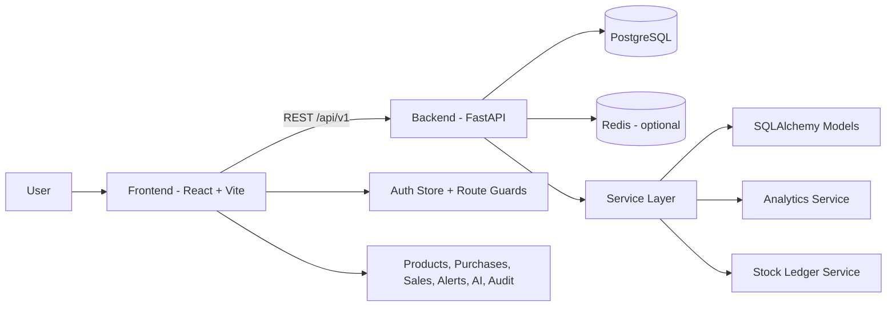
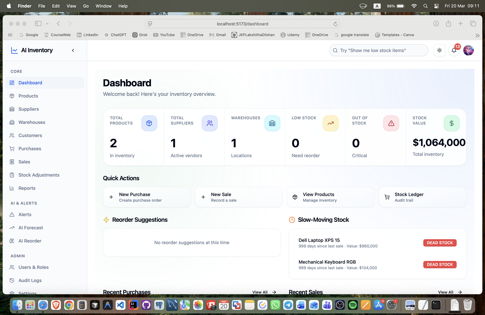
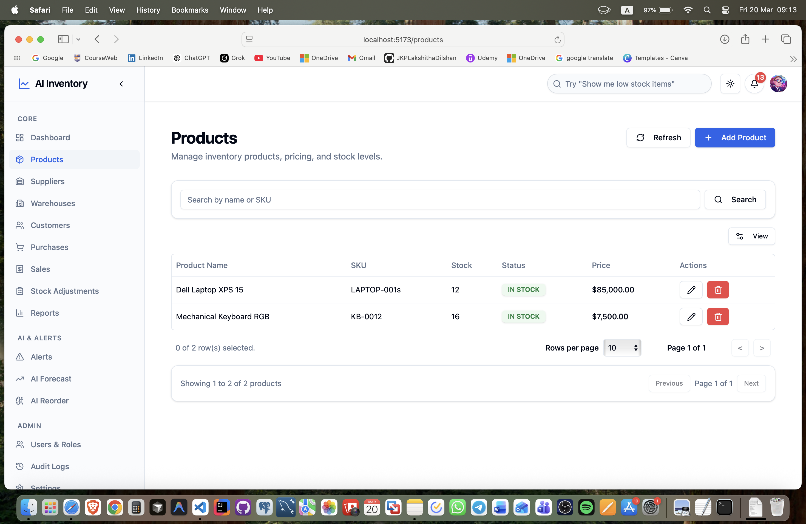
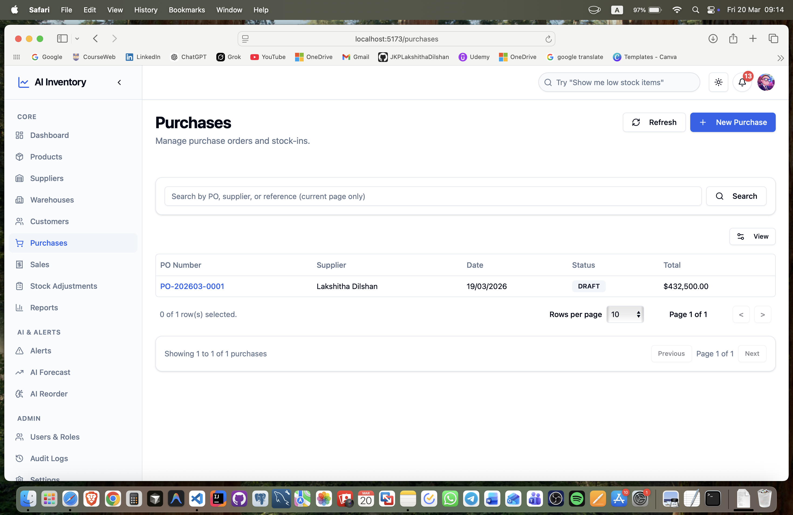
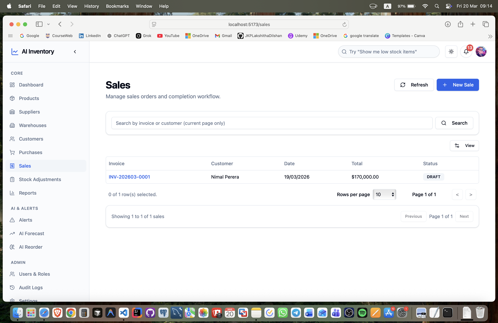
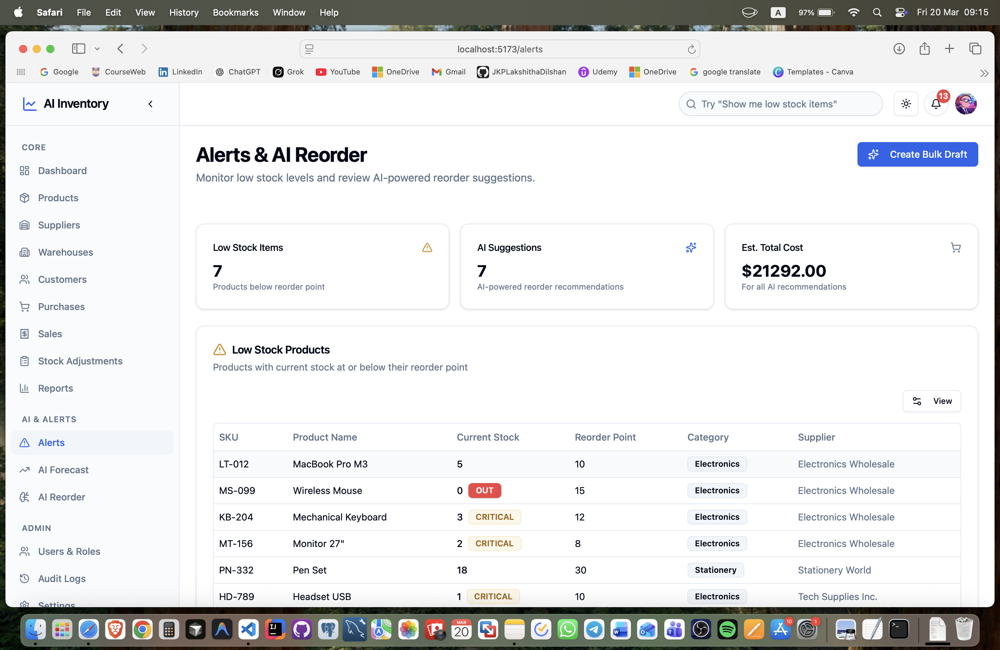

# AI Inventory Management System

A full-stack inventory operations platform for managing products, suppliers, purchases, sales, warehouse stock movements, and AI-assisted planning.

This project combines a React + TypeScript frontend with a FastAPI + PostgreSQL backend and includes role-aware access control, stock ledger traceability, analytics-driven alerts, and demand planning.

## What Problem This Solves

Many small and medium inventory teams still operate with disconnected spreadsheets and ad-hoc processes. This system centralizes core inventory workflows and adds decision support through:

- Automated low-stock and out-of-stock alerts
- Reorder recommendations based on sales velocity and lead time
- Demand forecast visualization
- End-to-end stock movement traceability with ledger entries

## Target Users

- Admin users managing system users and security-sensitive operations
- Operations/warehouse staff handling stock transactions
- Purchasing teams creating and receiving purchase orders
- Sales teams creating and completing sales orders
- Managers monitoring KPIs, risks, and planning signals

## Core Features

### Inventory Operations

- Product and category management
- Supplier management
- Warehouse management
- Purchase order lifecycle (draft, update, receive)
- Sales order lifecycle (draft, complete)
- Stock ledger with immutable movement records

### Analytics and Planning

- Dashboard KPIs and recent activity
- Inventory alerts with severity and filtering
- AI reorder recommendations with urgency and risk scoring
- Demand forecast (moving-average based)
- Slow-moving stock detection

### Security and Access

- JWT authentication with refresh flow
- Role-based route and navigation control in frontend
- Backend authenticated endpoint protection
- Superuser enforcement for sensitive user administration

### Quality and Tooling

- TypeScript frontend
- Async SQLAlchemy backend
- Pytest and Vitest test suites
- GitHub Actions CI workflow for lint/test/build

## Architecture



## Project Structure

```text
.
├── backend/
│   ├── app/
│   │   ├── api/v1/endpoints/
│   │   ├── core/
│   │   ├── models/
│   │   ├── schemas/
│   │   └── services/
│   ├── scripts/
│   ├── tests/
│   ├── requirements.txt
│   └── .env.example
├── frontend/
│   ├── src/
│   │   ├── app/
│   │   ├── components/
│   │   ├── features/
│   │   ├── services/
│   │   └── stores/
│   ├── package.json
│   └── .env.example
├── database/
│   └── schema.sql
└── .github/workflows/
		└── test.yml
```

## Role and Permission Model

Defined frontend roles:

- ADMIN
- HR
- MANAGER
- STAFF
- VIEWER

Permission examples:

- dashboard:view
- products:view / products:manage
- purchases:view / purchases:manage
- sales:view / sales:manage
- alerts:view / alerts:manage
- ai:forecast:view
- ai:reorder:view
- admin:users:manage
- admin:audit:view
- admin:settings

## API Overview

Base path: /api/v1

- Auth: /auth/login, /auth/me, /auth/refresh
- Users: /users, /users/roles
- Categories: /categories
- Products: /products, /products/low-stock/alerts
- Suppliers: /suppliers
- Warehouses: /warehouses
- Purchases: /purchases, /purchases/{id}/receive
- Sales: /sales, /sales/{id}/complete
- Stock Ledger: /stock-ledger
- Dashboard: /dashboard/stats, /dashboard/recent-activities
- Analytics: /analytics/inventory-alerts, /analytics/reorder-suggestions, /analytics/demand-forecast/{product_id}, /analytics/slow-moving-stock
- Forecast: /forecast/moving-average
- Notifications: /notifications, /notifications/read-all, /notifications/{id}/read
- Audit Logs: /audit-logs
- Health: /health, /health/db, /health/detailed

## Local Development Setup

### Prerequisites

- Python 3.12+
- Node.js 20+
- PostgreSQL 14+
- Redis (optional)

### 1) Clone Repository

```bash
git clone <your-repo-url>
cd ai-inventory-management-system
```

### 2) Backend Setup

```bash
cd backend
python -m venv .venv
source .venv/bin/activate
pip install -r requirements.txt
cp .env.example .env
```

Update backend/.env with your local database credentials.

Run backend:

```bash
uvicorn app.main:app --reload --port 8000
```

Backend docs:

- Swagger: http://localhost:8000/api/v1/docs
- ReDoc: http://localhost:8000/api/v1/redoc

### 3) Frontend Setup

```bash
cd ../frontend
npm install
cp .env.example .env
npm run dev
```

Frontend app:

- http://localhost:5173

### 4) Default Local Login

If your seed/admin bootstrap has run:

- Username: admin
- Password: admin123

Use strong credentials in non-local environments.

## Running Tests

### Backend

```bash
cd backend
source .venv/bin/activate
PYTHONPATH=. pytest -q
```

### Frontend

```bash
cd frontend
npm run test -- --run
```

## CI Pipeline

GitHub Actions workflow runs:

- Backend lint + tests
- Frontend lint + tests
- Frontend production build

Workflow file: .github/workflows/test.yml

## Environment Variables

### Backend

Use backend/.env.example as source of truth.

Critical variables:

- SECRET_KEY
- POSTGRES_USER
- POSTGRES_PASSWORD
- POSTGRES_DB
- POSTGRES_SERVER
- POSTGRES_PORT
- ENVIRONMENT
- DEBUG

### Frontend

Use frontend/.env.example.

Critical variable:

- VITE_API_BASE_URL

## Screenshots

### Dashboard



### Products table



### Purchase workflow



### Sales workflow



### Alerts and AI pages



## If you would like to collaborate, discuss improvements, or project opportunities, feel free to reach out.

- 👤 Lakshitha Dilshan  
- 📧 lakshithadilshan.info@gmail.com  
- 🔗 LinkedIn: https://www.linkedin.com/in/jkplakshithadilshan/ 
- 🌐 Portfolio: https://www.lakshithadilshan.me  

⭐ If you found this project useful, consider giving it a star!
